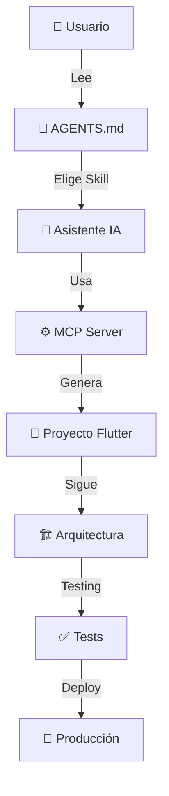

# 🏗️ Estructura del Proyecto Flutter Agent Skills

## 📂 Árbol de Archivos

```
flutter-agent-skills/
│
├── 📄 AGENTS.md                    # ⭐ Documentación principal de skills
├── 📄 README.md                    # Guía de inicio y uso
├── 📄 CONTRIBUTING.md              # Guía para contribuidores
├── 📄 CHANGELOG.md                 # Historial de cambios
├── 📄 STRUCTURE.md                 # Este archivo
├── 📄 LICENSE                      # Licencia MIT
├── 📄 .gitignore                   # Archivos ignorados por Git
│
├── 📁 .cursor/
│   └── 📄 mcp.json                 # ⚙️ Configuración Flutter MCP Server
│
└── 📁 examples/ (opcional)
    ├── 📁 mvvm_example/
    │   └── [Proyecto Flutter MVVM]
    └── 📁 clean_arch_example/
        └── [Proyecto Flutter Clean Architecture]
```

## 📚 Descripción de Archivos

### Archivos Principales

| Archivo | Descripción | Importancia |
|---------|-------------|-------------|
| `AGENTS.md` | 📖 Documentación completa de todos los skills disponibles | ⭐⭐⭐⭐⭐ |
| `README.md` | 🚀 Guía de inicio rápido y configuración | ⭐⭐⭐⭐⭐ |
| `.cursor/mcp.json` | ⚙️ Configuración del Flutter MCP Server | ⭐⭐⭐⭐⭐ |
| `CONTRIBUTING.md` | 🤝 Guía para nuevos contribuidores | ⭐⭐⭐⭐ |
| `CHANGELOG.md` | 📝 Registro de cambios y versiones | ⭐⭐⭐ |
| `LICENSE` | 📄 Licencia del proyecto (MIT) | ⭐⭐⭐ |

## 🎯 Skills Documentados en AGENTS.md

### 1️⃣ Patrón MVVM
```
📦 Skill ID: flutter-mvvm-pattern
📊 Nivel: Intermedio
🎨 Enfoque: Separación UI/Lógica
🔧 Herramientas: Provider, ChangeNotifier
```

**Estructura de Proyecto MVVM:**
```
lib/
├── core/
│   ├── constants/
│   ├── utils/
│   └── extensions/
├── models/           # 📊 Datos y lógica de negocio
│   ├── entities/
│   └── dto/
├── views/            # 🎨 Interfaz de usuario
│   ├── screens/
│   ├── widgets/
│   └── dialogs/
├── viewmodels/       # 🧠 Lógica de presentación
│   └── providers/
└── services/         # 🔌 APIs y servicios
    ├── api/
    ├── storage/
    └── navigation/
```

### 2️⃣ Clean Architecture
```
📦 Skill ID: flutter-clean-architecture
📊 Nivel: Avanzado
🎨 Enfoque: Separación en capas
🔧 Herramientas: BLoC, GetIt, Dartz
```

**Estructura de Clean Architecture:**
```
lib/
├── core/
│   ├── error/
│   ├── usecases/
│   ├── network/
│   └── utils/
├── features/
│   └── [feature_name]/
│       ├── data/              # 💾 Capa de Datos
│       │   ├── datasources/
│       │   │   ├── remote_datasource.dart
│       │   │   └── local_datasource.dart
│       │   ├── models/
│       │   └── repositories/
│       ├── domain/            # 🎯 Capa de Dominio
│       │   ├── entities/
│       │   ├── repositories/
│       │   └── usecases/
│       └── presentation/      # 🎨 Capa de Presentación
│           ├── bloc/
│           ├── pages/
│           └── widgets/
└── injection_container.dart   # 💉 Dependency Injection
```

### 3️⃣ Configuración Inicial
```
📦 Skill ID: flutter-project-setup
📊 Nivel: Básico
🎨 Enfoque: Setup estándar
```

### 4️⃣ Testing Comprehensivo
```
📦 Skill ID: flutter-testing-strategy
📊 Nivel: Avanzado
🎨 Enfoque: Unit/Widget/Integration tests
```

### 5️⃣ CI/CD Pipeline
```
📦 Skill ID: flutter-cicd
📊 Nivel: Avanzado
🎨 Enfoque: Automatización
```

## ⚙️ Flutter MCP Server

### Configuración (.cursor/mcp.json)

```json
{
  "mcpServers": {
    "dart": {
      "command": "dart",
      "args": ["mcp-server", "--force-roots-fallback"]
    }
  }
}
```

### 🔧 Capacidades

| Capacidad | Descripción |
|-----------|-------------|
| 🔍 `dart_analysis_get_errors` | Análisis estático de código |
| 📦 `pub_dev_search` | Búsqueda de paquetes |
| ➕ `pub_add` | Agregar dependencias |
| 🌳 Widget Tree | Inspección del árbol de widgets |
| 🐛 Error Detection | Detección de errores de runtime |
| ⚡ DTD Access | Dart Tooling Daemon |

## 🚀 Flujo de Uso



## 📋 Checklist de Uso

Para generar un nuevo proyecto:

- [ ] 1. Abrir proyecto en editor con MCP habilitado
- [ ] 2. Verificar que MCP Server está activo
- [ ] 3. Leer `AGENTS.md` y elegir un skill
- [ ] 4. Solicitar a IA que genere el proyecto usando el skill
- [ ] 5. Revisar la estructura generada
- [ ] 6. Ejecutar tests
- [ ] 7. Personalizar según necesidades

## 🎨 Ejemplos de Prompts

### Para MVVM:
```
Genera una app de lista de tareas usando flutter-mvvm-pattern con:
- CRUD de tareas
- Filtros por estado
- Búsqueda
- Persistencia local
```

### Para Clean Architecture:
```
Implementa un módulo de productos usando flutter-clean-architecture con:
- Listado de productos
- Detalle de producto
- Carrito de compras
- Integración con API REST
```

### Con MCP Server:
```
Usando el MCP server:
1. Analiza errores en el proyecto actual
2. Busca un paquete para manejo de estados
3. Agrégalo e implementa el patrón MVVM
4. Corrige cualquier error de layout
```

## 🔗 Referencias Rápidas

| Recurso | URL |
|---------|-----|
| 🌐 Flutter MCP Server | https://dart.dev/tools/mcp-server/ |
| 📖 Flutter Docs | https://docs.flutter.dev |
| 🎯 Dart Docs | https://dart.dev |

## 📊 Estadísticas del Proyecto

- **Skills Disponibles:** 5
- **Arquitecturas Principales:** 2 (MVVM, Clean)
- **Líneas de Documentación:** ~1000+
- **Ejemplos de Código:** 20+
- **Compatibilidad:** Flutter 3.35+, Dart 3.9+

## 🎯 Próximas Características

- [ ] Más skills (Riverpod, GetX, Modular)
- [ ] Ejemplos completos en `/examples`
- [ ] Templates automatizados
- [ ] Video tutoriales
- [ ] Integración con más IDEs

---

**💡 Tip:** Comienza con el skill `flutter-mvvm-pattern` si eres nuevo en arquitecturas de Flutter, o salta directamente a `flutter-clean-architecture` si buscas máxima escalabilidad.

**Última actualización:** Diciembre 2025

